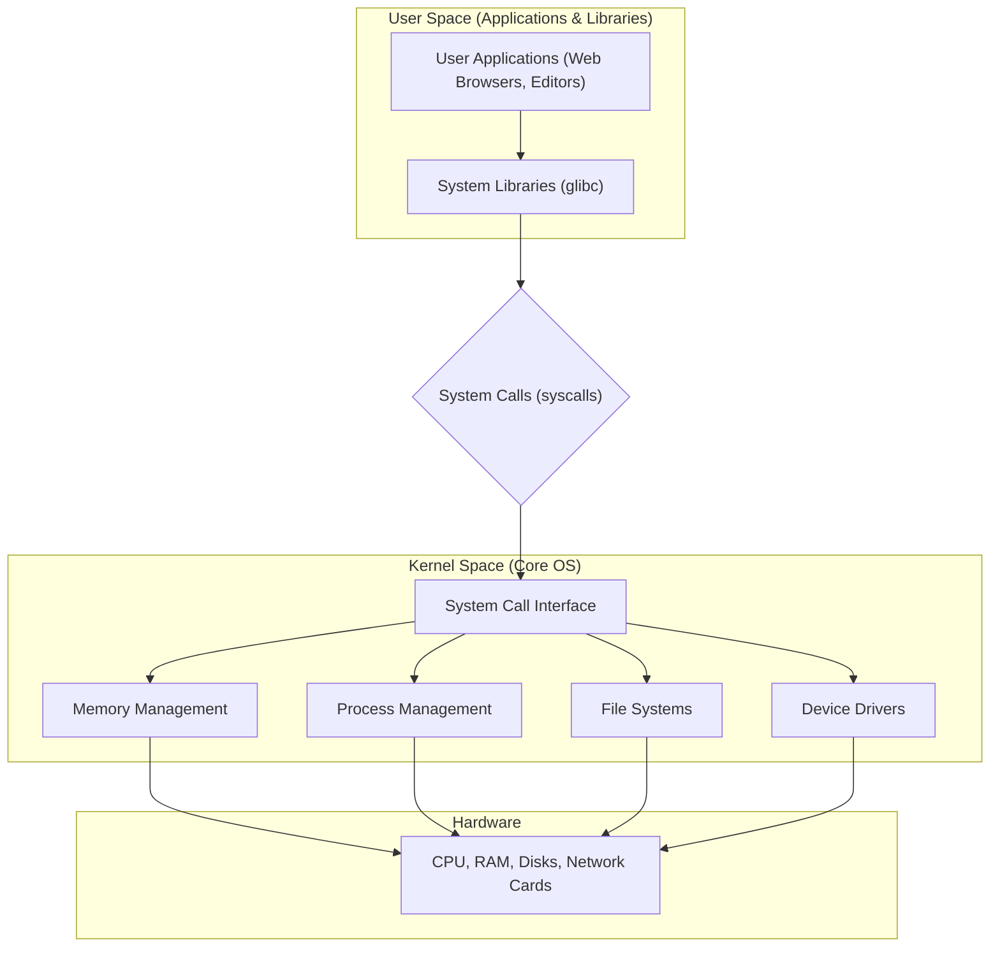
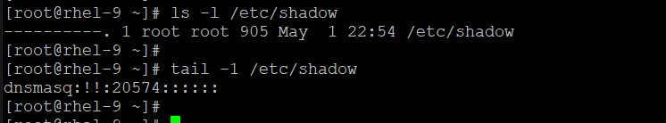
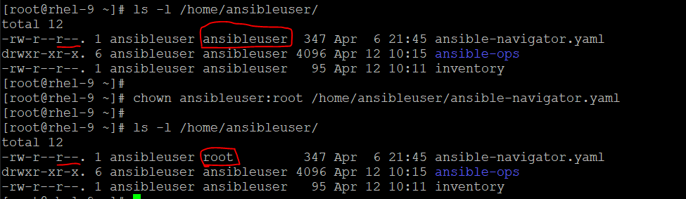
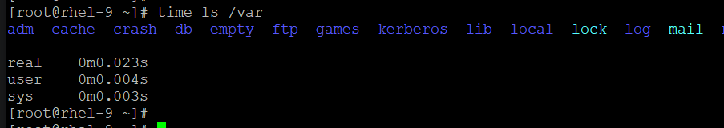
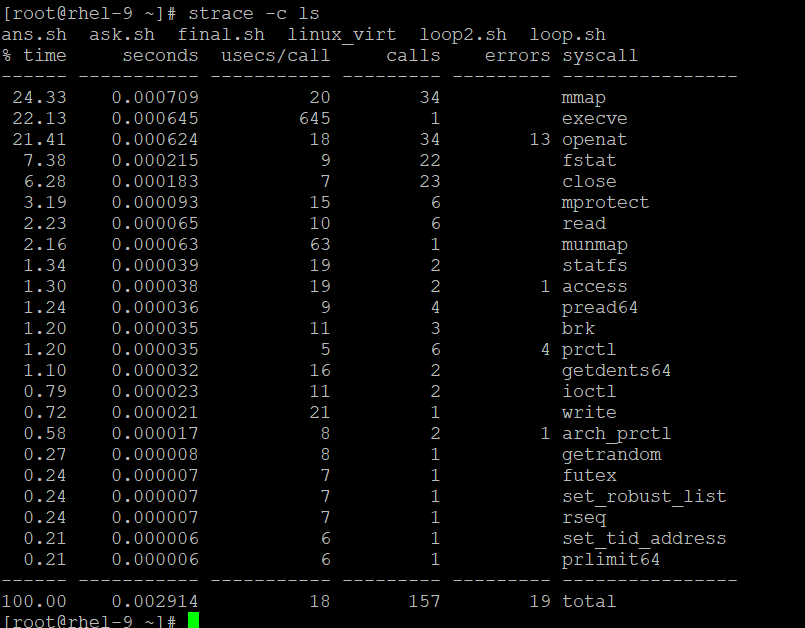
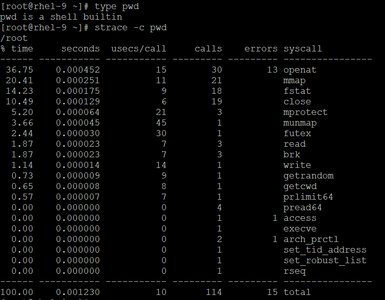
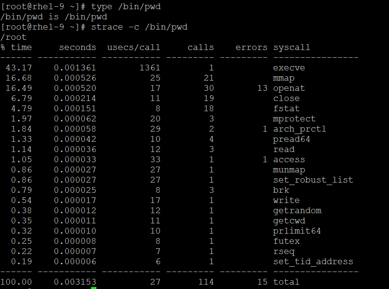

# Linux Architecture

The Linux operating system is divided into two primary "spaces" to provide stability, security, and isolation.

1. User Space:
    
    This is the area where all your user-level applications run (e.g., your web browser, text editor, or shell).

    - Characteristics: Applications run with restricted privileges. They cannot directly access hardware or critical system memory.
    - Entities:
        - User Applications: Programs that interact directly with the user.
        - System Libraries: Code that provides common functions (like glibc for C programs) which act as an intermediary between the application and the kernel.
2. Kernel Space:
    
    This is the heart of the operating system, running with the highest level of privilege (often called "Supervisor Mode" or "Kernel Mode").

    - Characteristics: It has unrestricted access to the entire machine, including hardware, memory, and CPU resources. It manages the resources for all applications.
    - Entities:
        - System Call Interface: The "gatekeeper" that allows user applications to request services from the kernel.
        - Process Management: Responsible for creating, scheduling, and terminating processes.
        - Memory Management: Tracks physical memory and allocates it to processes.
        - File Systems: Manages the storage, organization, and retrieval of data on disks.
        - Device Drivers: Translates requests from the kernel into commands that specific hardware components (like a GPU or network card) can understand.

    **How They Interact**:

    When an application needs to do something "privileged"—like reading a file from the disk or sending data over the network—it cannot do it directly. Instead, it makes a System Call (syscall). This triggers a controlled "context switch," where the CPU switches from user mode to kernel mode to perform the task safely on behalf of the application, then returns the result.



---
# Lets verify root power:

- Here, we can see no permission on shadow file but still root user can list it, read it or even edit it.



- Even, it can modify the permission on a file where root has no permission.



# `TIME` command

👉 The shell time command measures how long another command takes to run.

It prints timing stats such as:  
- real: wall-clock time (how long you waited)
- user: CPU time spent in user space (your program + libraries)
- sys: CPU time spent in kernel space (OS work: syscalls, I/O, scheduling, etc.)



# `STRACE` command

 👉 Strace (System Call Trace): 
- It is a powerful diagnostic tool used to monitor the interaction between a program and the Linux kernel. 
- Whenever a program wants to do something like read a file, send a network packet, or create a process, it must ask the kernel for permission via a system call. strace intercepts and records these calls in real-time. 
- Commands prints out a trace of system calls.
- It can also report how long they took in CPU time, not elapsed time.

✅ When you run strace ls, you see the behind-the-scenes "requests" the ls command makes:
- openat(...): "Hey kernel, open this directory."
- getdents(...): "Tell me what files are inside."
- write(1, "file.txt"...): "Display the filename to the screen (Standard Output)."
- close(3): "I'm done with this file." 

✅ Common Troubleshooting Use Cases
- Missing Files: 
    If a program fails to start, strace will show exactly which configuration file it tried to open and failed with ENOENT (No such file or directory).
- Permission Issues:
    You can see if a call failed with EACCES (Permission denied), telling you exactly which file needs a chmod.
- Hangs/Slowdown:
    Using the -T flag shows how long each individual call took, helping you find where a program is getting stuck.
- Network Debugging:
    Using -e trace=network lets you see if a program is successfully opening sockets or if a connect() call is failing

✅ Essential Commands for your Lab
```
Command 	                Long option                 What it does
strace ./my_program	                                    Traces a program from start to finish.
strace -p <PID>	            --attach=PID                Attaches to a process that is already running.
strace -c ls	            --summary-only              Prints a summary table of all calls (counts and time spent).
strace -f ./my_app	        --follow-forks              Follows forks (traces child processes/threads too).
strace -e open ./app	                                Filters to only show open system calls.
strace -o log.txt ./app	    output=FILENAME             Saves the massive amount of output to a file.
strace -P <PATH>            --trace-path=PATH           Track a process when interacting with specified path
strace -T                   --syscall-times             Display times in the output
```

✅ We can generate a summary for a particular binary with -c flag:




✅ Common System Calls
Understanding some of the most commonly encountered system calls in strace output will help you get started. Here’s a quick primer:
- open/openat: Used to open files. The openat variant is newer and more flexible.
- read and write: These calls are used to read from and write to file descriptors (e.g., files, pipes, sockets).
- close: Closes an open file descriptor.
- execve: Used to execute a program. This is often the first call you’ll see in strace output when running a command.
- mmap: Maps files or devices into memory. This is commonly used for performance optimization, especially with large files.
- brk and mmap: These calls are used to request more memory for the process from the kernel.
- fork, vfork, clone: These calls are used to create new processes or threads.
- fstat: Retrieves information about a file (e.g., file size, permissions).
- poll, select, epoll_wait: These calls are used for monitoring file descriptors to see if I/O is possible.

✅ Time to action:
- We can calculate the cummulative time took by a process for each call but it differs for a shell built-in function and binary (actual command) from system. Let's find out ls, or pwd.

**pwd is a shell builtin**


**/bin/pwd is /bin/pwd**


- For pwd (Builtin):strace is an external command. To run it, Bash has to create a new process. Inside that new process, strace tries to execute pwd. Since strace is not a shell, it can't run "builtins"—so it looks in your $PATH, finds /usr/bin/pwd, and runs that instead.
    - Result: You are actually tracing the binary version of pwd even when you don't type the full path.

- For /bin/pwd (Binary):
    You are explicitly telling the system to run the file located at /bin/pwd.
    - Result: The trace is almost identical because, in both of your examples, strace ended up running the binary.

★ The binary will always take more CPU time and system resources than the builtin.
(check the last line of above snippet where total time is displayed)
