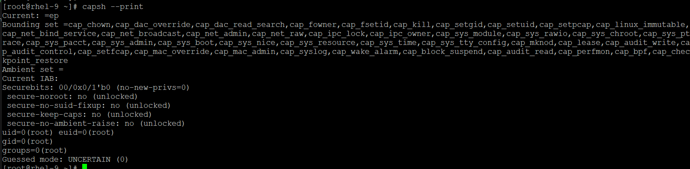
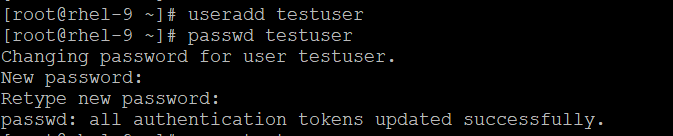
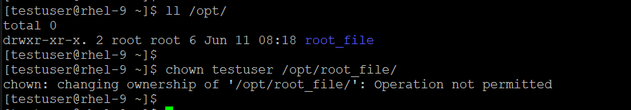
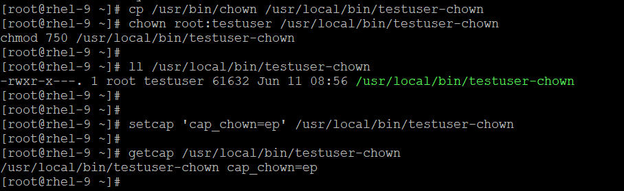
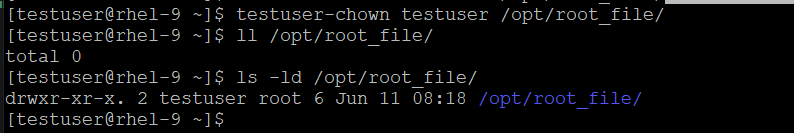

# Linux Capabilities — In Detail
Traditionally, Linux processes were either root (UID 0) or normal user. Root can do everything; a normal user can't bind to ports below 1024, change the system clock, or bypass file permissions. But many processes only need one or two special privileges — not full root.

Capabilities solve this by breaking root's power into ~40 distinct units. You can give a process exactly what it needs — nothing more. Linux capabilities are a way to split the powerful root privileges into smaller, specific permissions. Instead of giving a program full root access, you can give it only the exact capability it needs.

### Why they matter
They improve security by following the **principle of least privilege.** That means a process gets only the power it actually needs, not everything root can do.

### Where they are used
- Linux processes
- Containers
- Security hardening
- Setting fine-grained privileges for services

## Types of Capabilities (The Major Ones)
There are about 40 capabilities in modern Linux. Here are the most practical ones:

| Capability | What it allows |
| --- | --- |
| CAP_CHOWN | Change file ownership |
| CAP_DAC_OVERRIDE | Bypass file read/write/execute permission checks |
| CAP_DAC_READ_SEARCH | Bypass file read and directory search checks |
| CAP_FOWNER | Bypass permission checks on operations that require file owner |
| CAP_KILL | Bypass permission checks for sending signals |
| CAP_NET_ADMIN | Perform network administration (interface config, firewall, etc.) |
| CAP_NET_BIND_SERVICE | Bind a socket to a privileged port (< 1024) |
| CAP_NET_RAW | Use raw and packet sockets |
| CAP_SETUID | Make arbitrary manipulations of process UIDs |
| CAP_SETGID | Make arbitrary manipulations of process GIDs |
| CAP_SYS_ADMIN | A wide range of admin operations (mount, swap, etc.) — use carefully |
| CAP_SYS_TIME | Change the system clock |
| CAP_SYS_NICE | Raise process priority and set nice values |
| CAP_SYS_PTRACE | Trace any process (attach debugger to any process) |
| CAP_AUDIT_WRITE | Write to kernel audit log |

📌 Full list: Check man capabilities on any Linux system.
```
- if not installed then you can install as:
# dnf install -y man-pages

# man capabilities
```
## Capability Sets
Each process has 5 capability sets:

| Set Name | Meaning |
| --- | --- |
| Effective (E) | The capabilities currently being used by the kernel for permission checks |
| Permitted (P) | Capabilities the process is allowed to have (superset of Effective) |
| Inheritable (I) | Capabilities preserved across execve() |
| Bounding (B) | Limit on what capabilities a process can ever gain |
| Ambient (A) | A set of capabilities preserved across execve() for non-root programs |

- How they interact conceptually
```
Permitted  →  Effective   (you can "use" what you're "allowed")
Inheritable → survives execve (child process can inherit it)
Bounding    → hard upper limit on everything
Ambient     → keeps capabilities alive after execve for non-privileged processes
```
## Practical Commands

- Check Your Current Shell Capabilities
    ```
    List current capabilities of the shell
    # capsh --print

    Drop all capabilities and see what you can't do
    # capsh --drop=cap_net_raw,cap_net_admin --
    ```
    

- Check capabilities on a file
    ```
    Check if a binary has capabilities assigned
    # getcap /path/to/binary

    [root@rhel-9 ~]# getcap /usr/bin/arping
    /usr/bin/arping cap_net_raw=p
    ```

- Assign capabilities to a file
    ```
    Use setcap command to assign the capability, for example:

    Give a binary the ability to bind to privileged ports
    # sudo setcap cap_net_bind_service=ep /usr/local/bin/myapp

    # Give multiple capabilities at once
    sudo setcap cap_net_bind_service,cap_net_admin=ep /usr/local/bin/myapp

    # Remove all capabilities from a file
    sudo setcap -r /usr/local/bin/myapp
    ```

- Check capabilities of a running process
    ```
    getpcaps <PID>

    [root@rhel-9 ~]# ps -ef | egrep '741|714'
    root         714       1  0 Jun10 ?        00:00:00 /sbin/auditd
    dbus         741     740  0 Jun10 ?        00:00:01 dbus-broker --log 4 --controller 9 --machine-id a9a2cf5a2699432baa5a988fce4c2454 --max-bytes 536870912 --max-fds 4096 --max-matches 131072 --audit
    
    [root@rhel-9 ~]# getpcaps 714
    714: =ep

    [root@rhel-9 ~]# getpcaps 741
    741: cap_audit_write=eip

    Why getpcaps 741 shows cap_audit_write=eip?
    dbus-broker is running with the capability:
        cap_audit_write = permission to write to the Linux audit subsystem
        e = Effective
        i = Inheritable
        p = Permitted   

    Why getpcaps 714 shows only =ep?
    This usually means the process has the full effective and permitted capability sets as empty or none specifically listed in the getpcaps display format. 
    ```

- Check Libuser / Capability Modules:

    If your system uses explicit security modules (like pam_cap.so), a user might be assigned inherited capabilities upon logging in. You can check the configuration file to see if a specific user is mapped to specific capabilities:
    
    `# cat /etc/security/capability.conf`
    
    If /etc/security/capability.conf is missing, because Red Hat Enterprise Linux 9 (RHEL 9) does not install or enable the pam_cap.so module by default. In modern Linux distributions, assigning capabilities directly to specific human users at login is rarely used. Instead, system administrators use standard tools to manage privileges.
    
    Here is how you can easily handle both scenarios on your RHEL 9 system without that configuration file.

    - **Scenario 1: Granting privileges without full root/sudo**
    
        Instead of assigning capabilities directly to a user account, you assign them to the specific binary that the user needs to run.
        ```
        Assign the capability to the file:
        # setcap 'cap_net_bind_service=+ep' /usr/local/bin/myapp

        Verify it was applied successfully:
        # getcap /usr/local/bin/myapp

        Now, any regular user can execute myapp, and it will have the privilege to bind to low ports (like port 80 or 443) without needing sudo.
        ```

    - **Scenario 2: Managing privileges for containers (Podman)**

        Rootless containers run entirely inside the user's unprivileged session. If an application inside the container needs a capability (like CAP_NET_ADMIN to configure a VPN or firewall), you must pass it dynamically when you start the container:
        ```
        # podman run --cap-add=NET_ADMIN -d my-network-image

        Note: A rootless user can only add capabilities that their own user account is fundamentally allowed to use on the host system.
        ```
---
## How to configure PAM to enable capability.conf for a user account?

Step 1: Install the Necessary Utilities

    # dnf install -y libcap-ng-utils

Step 2: Create the Configuration File

    vi /etc/security/capability.conf
    # Add a line to grant a specific capability to a specific user. For example, to give ansibleuser the capability to change file ownership (cap_chown), add this line:

    cap_chown   ansibleuser
    ---
    * Format: capability_name  username
    * Alternative (All capabilities): Use all to grant all capabilities to a specific user.

Step 3: Enable the PAM Module
- RHEL 9 uses authselect to manage the PAM configuration profiles. Directly modifying PAM files in /etc/pam.d/ is highly discouraged because system updates will overwrite your changes.Instead, use authselect to safely inject pam_cap.so.
    ```
    Check your current active profile:
    # authselect current

    Create a custom profile based on your current one:
    # authselect create-profile custom-sssd --base-on=sssd

    Edit the custom PAM configuration file:
    # vi /etc/authselect/custom/custom-sssd/password-auth
    # vi /etc/authselect/custom/custom-sssd/system-auth

    Add the following line at the very bottom of these files (under the session section):
    session     optional      pam_cap.so

    Switch to your new custom profile:
    # authselect select custom/custom-sssd --force
    ```
    **_It might not work with modern or latet linux (RHEL9+). In RHEL 9, the Linux kernel explicitly prevents standard user logins from receiving ambient capabilities directly into an interactive shell process tree if that shell was started by a non-root process. The kernel treats this as an unprivileged UID transition and forcefully zeroes out the Ambient set for security. Because of this kernel-level design, it is impossible to get a raw, unmodified interactive shell (/bin/bash) to inherit ambient capabilities organically on RHEL 9 without either a file capability helper or a profile wrapper._**  

    ```
    IF ABOVE STEPS DOESN'T WORK THEN WE CAN TRY THE `keepcaps` OPTION, WHICH ALLOWS A PROCESS TO RETAIN ITS PERMITTED CAPABILITIES. 
    IT SUPPORTS THE `defer` OPTION, WHICH CAUSES `pam_cap.so` TO REAPPLY AMBIENT CAPABILITIES WITHIN A CALLBACK TO `pam_end()`.
    ```
    **IF ABOVE STPES DOESN'T WORK, THEN FOLLOW BELOW**
    ```
    Remove the line you added earlier in custom PAM configuration file.
    Locate the auth section (near the top of the file) and place the module immediately after your main authentication module line (pam_sss.so or pam_unix.so):
        auth        sufficient    pam_sss.so forward_pass
        auth        optional      pam_cap.so keepcaps defer
    
    Do the exact same thing for both files.

    Apply the changes to the system:
    # authselect apply-changes

    Fix the Syntax in capability.conf
    # cat << 'EOF' > /etc/security/capability.conf
    ^cap_chown,cap_chown testuser
    none *
    EOF

    - ^cap_chown,cap_chown explicitly raises cap_chown into the Ambient (^) vector and the Inheritable vector simultaneously.
    - none * acts as a required catch-all security boundary to keep other system accounts clean.
    ```

Step 4: Verify the Configuration
- To test that it works, open a completely new terminal session and log in as the user you modified (e.g., ansibleuser).
    ```
    Run the following command to check if the capability is inherited in the Inheritable set: 
    # capsh --print

    Look at the "Inheritable/Current/Ambient set/Current IAB" line in the output. It should now list cap_chown (or whichever capability you specified).
    ```


### Let see this in action with System Administrator Approach (File Capabilities) for all LINUX versions

1) Add any new new user:

    `# useradd testuser`

    

2) Try to change the ownership of root owned file/directory:

    

3) Create a secure wrapper script or binary execution link as root

    `# cp /usr/bin/chown /usr/local/bin/testuser-chown`

4) Restrict access so ONLY testuser can run it:

    `# chown root:testuser /usr/local/bin/testuser-chown`
    `# chmod 750 /usr/local/bin/testuser-chown`

5) Assign the specific capability directly to this copy:

    `# setcap 'cap_chown=ep' /usr/local/bin/testuser-chown`

    

6) Now, testuser does not need any ambient capabilities on their login shell. They simply run:

    `# testuser-chown testuser /opt/root_file/`
    

