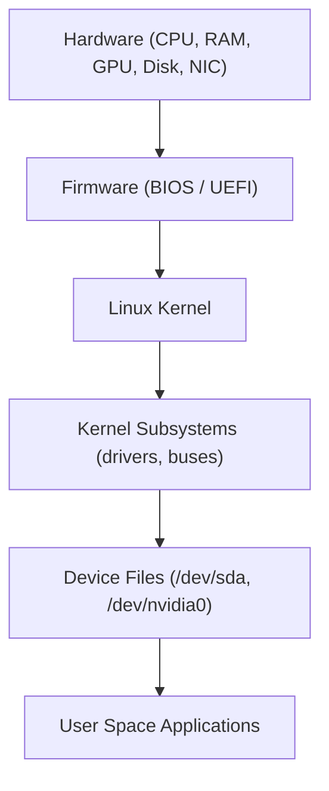
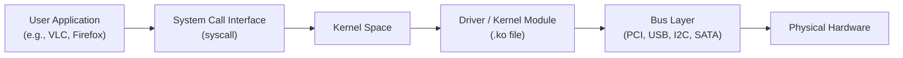

# Linux Hardware Communication — Deep Dive
🔑 The kernel is the brain — it sits between hardware and applications. It never lets user programs talk directly to hardware. Everything goes through the kernel.

Linux uses drivers (kernel modules) to talk to hardware via PCIe/USB buses

## How Linux Communicates with Hardware (Overview)
When you power on a Linux machine, there is a chain of communication:
---

---
## The Hardware Communication Stack

Here's how each layer works:

- User Application — e.g., ffmpeg, nvtop, your app
- System Call — bridge between user space & kernel (e.g., open(), read(), ioctl())
- Kernel Subsystems — block layer, network layer, DRM/GPU layer etc.
- Device Driver — the actual code that knows how to talk to a specific chip
- Bus Layer — physical/protocol buses like PCIe, USB, I2C
- Hardware — the real chip

lshw, dmidecode, lspci are tools that query hardware info from different sources
Most Linux drivers are GPL open source and live inside the kernel tree
Proprietary drivers can't be merged into the kernel due to GPL licensing
NVIDIA has historically been the most notorious for proprietary drivers — but since 2022, they released nvidia-open kernel modules
nvtop is an excellent real-time GPU monitoring tool for NVIDIA, AMD, and Intel GPUs