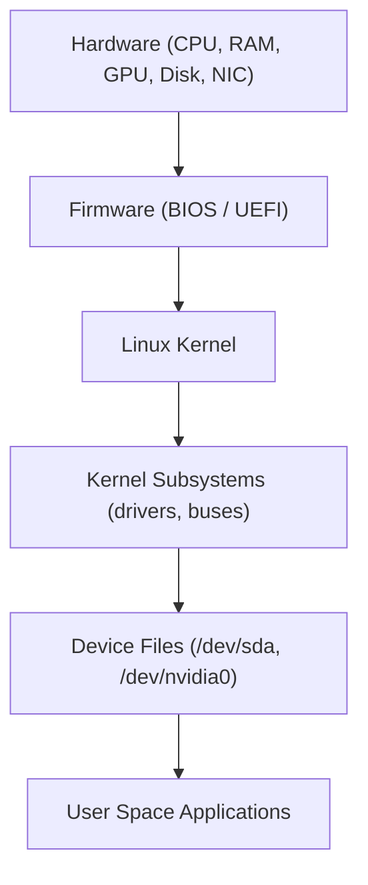
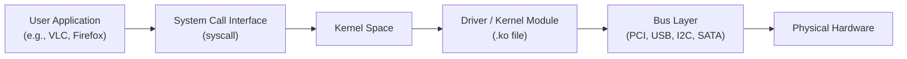
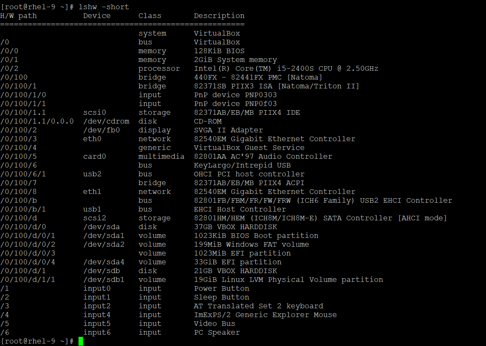
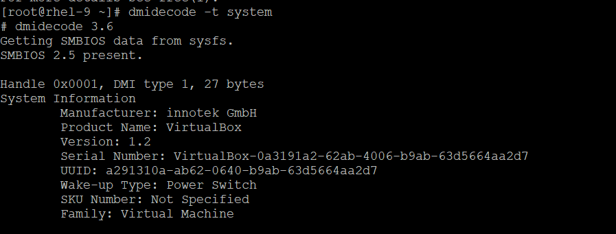
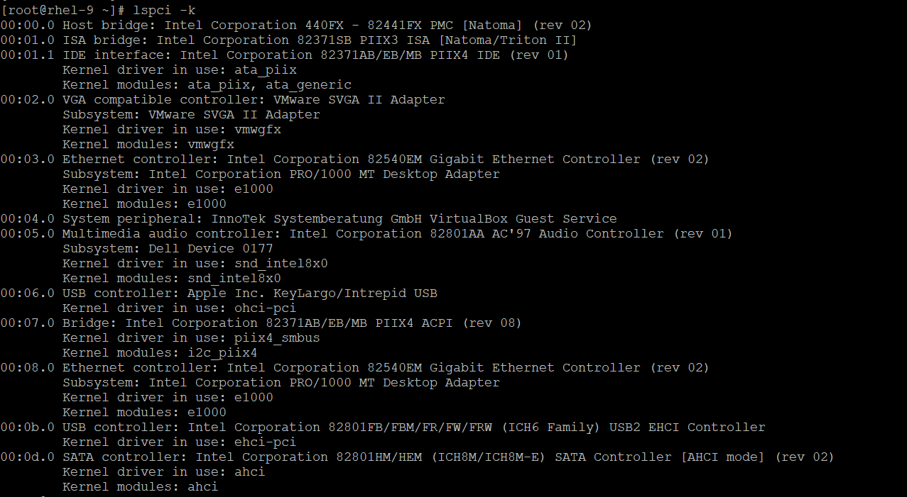
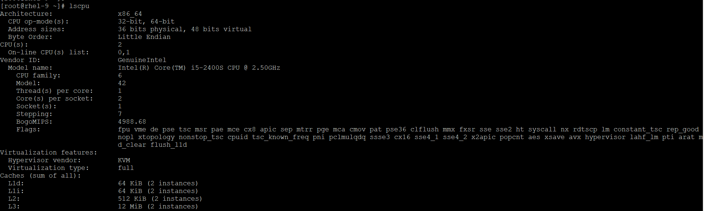
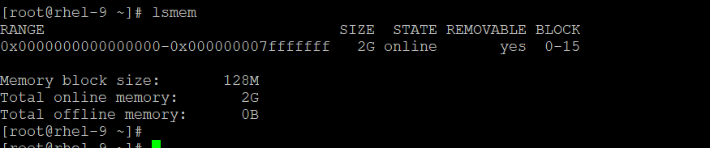

# Linux Hardware Communication — Deep Dive
🔑 The kernel is the brain — it sits between hardware and applications. It never lets user programs talk directly to hardware. Everything goes through the kernel.

Linux uses drivers (kernel modules) to talk to hardware via PCIe/USB buses

## How Linux Communicates with Hardware (Overview)
When you power on a Linux machine, there is a chain of communication:
---

---
## The Hardware Communication Stack

Here's how each layer works:

- User Application — e.g., ffmpeg, nvtop, your app
- System Call — bridge between user space & kernel (e.g., open(), read(), ioctl())
- Kernel Subsystems — block layer, network layer, DRM/GPU layer etc.
- Device Driver — the actual code that knows how to talk to a specific chip
- Bus Layer — physical/protocol buses like PCIe, USB, I2C
- Hardware — the real chip

## Hardware Discovery Tools

1) 🔧 lshw — List Hardware (Full Summary)
- lshw reads data from multiple sources:
    - proc filesystem
    - /sys filesystem (sysfs)
    - DMI/BIOS tables
    - Device drivers
```
# Full hardware info
sudo lshw

# Short summary
sudo lshw -short

# Only memory
sudo lshw -class memory

# HTML output
sudo lshw -html > hardware.html
```
📌 lshw tells you what hardware is there, what driver is loaded, and the bus address.
📌 We can report the hardware details in html/xml/json format. `# lshw -html` check `# lshw --help` for more info.

--> [checkout my hadware details from test vm](./images/hardware.html)



2) 🔧 dmidecode — Read BIOS/UEFI Tables (DMI/SMBIOS)
- When your system boots, the BIOS/UEFI firmware stores hardware information in SMBIOS tables (System Management BIOS). dmidecode reads those tables directly.

📌 dmidecode reads data directly from firmware — even if the OS hasn't loaded a driver yet.
📌 All options/flags/types worke well on physical device, not in virtual machine.




3) 🔧 lspci — List PCI Devices
- PCI/PCIe is the main bus for GPU, NIC, NVMe, USB controllers etc. lspci reads /sys/bus/pci/ and the PCI ID database.
```
# List all PCI devices
lspci

# Verbose (detailed)
lspci -v

# Very verbose (more details)
lspci -vv

# Show kernel driver loaded
lspci -k

# Filter for GPU only
lspci | grep -i vga

# Filter for network
lspci | grep -i network
```


--> `# lspci -k` shows what all drivers are loaded in kernel, check out for above snipeets:
🔑 Key Drivers Loaded 

```
# Core Drivers Active in Your VM
ata_piix       → Legacy IDE/PATA
vmwgfx         → Display (VMware graphics)
e1000          → Ethernet (both NICs)
snd_intel8x0   → Audio
ohci-pci       → USB 1.1
piix4_smbus    → Power management
ehci-pci       → USB 2.0
ahci           → SATA/SSD storage
```

4) lscpu — For Processor Information
- Instead of the BIOS table, this reads /proc/cpuinfo, which the kernel generates based on what the CPU actually reports.
- This will show you the architecture, core count, threads, and the specific CPU model (e.g., Intel Core i7 or AMD Ryzen).



5) lsmem — For memory information
```
# See summary of total memory
free -h

# See memory blocks as the kernel sees them
lsmem

# See very detailed memory stats
cat /proc/meminfo
```



---


**Summary of Tools
| If you want to see... | Use this (Physical) | Use this (Virtual Machine) |
| --- | --- | --- |
| CPU Details | dmidecode -t processor | lscpu or cat /proc/cpuinfo |
| RAM Details | dmidecode -t memory | lsmem or free -m |
| Mainboard | dmidecode -t baseboard | lspci |
| System Info | dmidecode -t system | hostnamectl |

---
Quick Comparison
| Tool | Data Source | Best For |
| --- | --- | --- |
| lshw | /proc, /sys, DMI, drivers | Full hardware overview |
| dmidecode | SMBIOS/DMI (BIOS tables) | Firmware-level hardware info |
| lspci | PCI bus / /sys/bus/pci | PCI devices + loaded drivers |
| lscpu | /proc/cpuinfo | CPU Information |
| lsmem | /sys/devices/system/memory/ | /proc/meminfo (memory block information)


lshw, dmidecode, lspci are tools that query hardware info from different sources
Most Linux drivers are GPL open source and live inside the kernel tree
Proprietary drivers can't be merged into the kernel due to GPL licensing
NVIDIA has historically been the most notorious for proprietary drivers — but since 2022, they released nvidia-open kernel modules
nvtop is an excellent real-time GPU monitoring tool for NVIDIA, AMD, and Intel GPUs